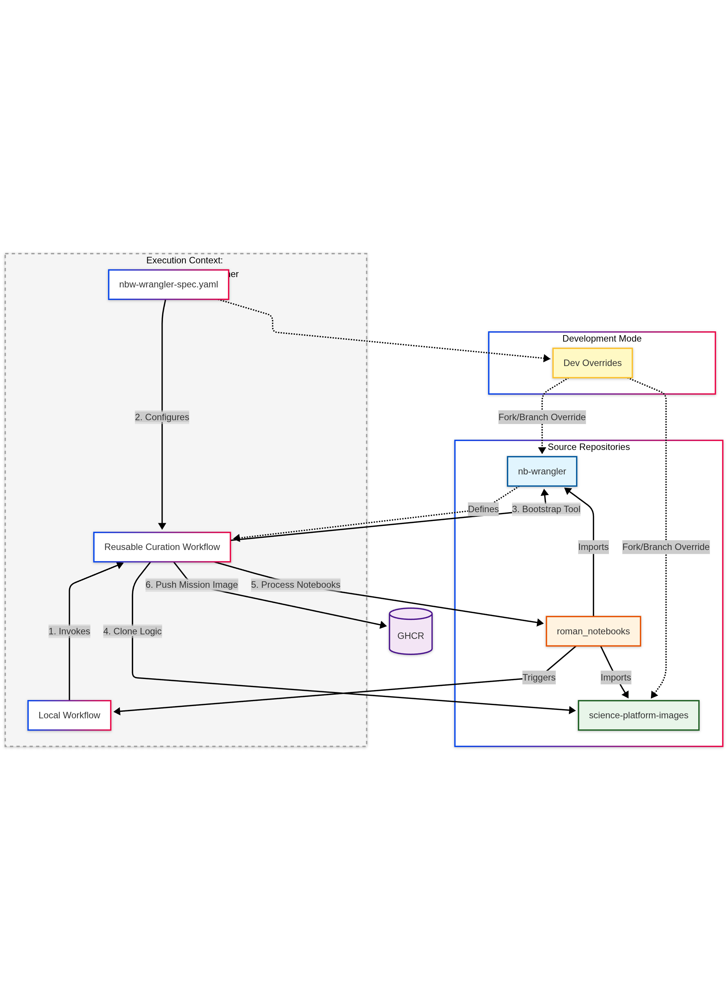

# The Automated Image Pipeline

The `nb-wrangler` ecosystem has evolved from a set of manual tools into a fully automated pipeline for defining, curating, building, and testing notebook environments. This document outlines the architecture, the "chicken-and-egg" resolution strategy, and the end-to-end flow.

## Architecture & Repository Relationships



The pipeline relies on the interaction between three key repository types:

1.  **Notebook Repositories** (e.g., `roman_notebooks`):
    *   **Role:** The "Source of Truth".
    *   **Content:** Jupyter notebooks and the **Wrangler Spec** (`nbw-wrangler-spec.yaml`).
    *   **Responsibility:** Defines *what* goes into the image (notebooks, data, packages) and *which version* of the tools to use.

2.  **The Wrangler Repository** (`nb-wrangler`):
    *   **Role:** The "Tool & Orchestrator".
    *   **Content:** The `nb-wrangler` Python package, the bootstrap script, and the **Reusable Workflows** (e.g., `curate-reusable.yml`).
    *   **Responsibility:** Provides the logic for curation, resolution, and the CI/CD definitions used by notebook repos.

3.  **Science Platform Images** (`science-platform-images` or SPI):
    *   **Role:** The "Builder".
    *   **Content:** Dockerfiles, base images, and build scripts.
    *   **Responsibility:** Provides the fundamental container infrastructure that `nb-wrangler` builds upon.

## The Resolution Strategy (Chicken-and-Egg)

A critical feature of this pipeline is its ability to self-bootstrap the correct version of the tooling based on the specification file itself. This solves the "chicken-and-egg" problem where the pipeline needs the tool to read the spec, but the spec defines which version of the tool to use.

### How it Works

1.  **The Bootstrap Script:** The entry point is the `nb-wrangler` bash script. This script is designed to be lightweight and "smart".
2.  **Spec-First Resolution:** When you run `./nb-wrangler bootstrap my-spec.yaml`, the script:
    *   Installs a minimal environment (micromamba, yq).
    *   Reads `my-spec.yaml`.
    *   Extracts the `system.nb-wrangler` repo and ref.
    *   **Checks for Overrides:** If `NBW_DEV=1`, it looks for `dev_overrides.system.nb-wrangler`.
3.  **Self-Installation:** The script then clones *that specific version* of `nb-wrangler` and installs it.

### `dev_overrides`

This feature allows developers to test changes to the wrangler tool itself without merging them to main. By defining a `dev_overrides` section in the spec, you can force the pipeline to use a feature branch of `nb-wrangler` for that specific build.

```yaml
system:
  nb-wrangler:
    repo: https://github.com/spacetelescope/nb-wrangler.git
    ref: main

dev_overrides:
  system:
    nb-wrangler:
      repo: https://github.com/my-fork/nb-wrangler.git
      ref: my-feature-branch
```

## The End-to-End Pipeline

The core of the automation is the `curate-reusable.yml` workflow. This workflow automates tasks that were previously manual.

### The Flow

1.  **Trigger:**
    *   **Primary:** A push to the Notebook Repository (e.g., updating a notebook or the spec).
    *   **Secondary:** A manual `workflow_dispatch` trigger.
    *   **Test:** A Pull Request (triggers validation workflows).

2.  **Bootstrap & Resolve:**
    *   The workflow downloads the `nb-wrangler` bootstrap script.
    *   It executes `./nb-wrangler bootstrap nbw-wrangler-spec.yaml`, automatically resolving and installing the correct tool version.

3.  **Automated Curation:**
    *   Runs `nb-wrangler --curate`.
    *   Scans all notebooks for imports.
    *   Compiles strict lock-files for `pip` and `mamba` dependencies.
    *   Updates the spec with the "frozen" state of the environment.

4.  **SPI Injection:**
    *   Runs `nb-wrangler --inject-spi`.
    *   Clones the `science-platform-images` repo.
    *   Injects the curated requirements (pip requirements, mamba specs) into the SPI build context.

5.  **Image Build:**
    *   **Degenerate Image:** Builds a lightweight Docker image containing *only* the resolved spec. This serves as an immutable record of the environment.
    *   **Full Notebook Image:** Builds the complete Docker image using the injected SPI context.

6.  **Verification:**
    *   **Scan:** Runs security scans (e.g., Trivy) on the built image.
    *   **Test:** Executes `nb-wrangler --test-notebooks` *inside* the built container to verify that every notebook runs correctly in the final environment.

7.  **Publish:**
    *   Pushes the verified images to the container registry (GHCR).

## Usage for Curators

For a notebook curator, the process is now:

1.  **Edit** your notebooks or `spec.yaml` locally.
2.  **Push** to your branch.
3.  **Watch** the GitHub Action in your repo.

The pipeline takes over, determining the correct tooling, freezing dependencies, building the image, and verifying it works. You no longer need to manually run `--curate` or `--submit-for-build` unless you are developing locally.
