# Persistent Platform Environments

## Scope

This document explains the concepts behind persistent platform environments
and proposes the set of requirements to implement.

## Overview

Persistent Platform Environments (PPE's) are science platform mamba
environments that are installed directly on the platform instead of being
built into images. Wrangler makes it easy to manage the performance
differences between container storage (fast) and EFS (horrible small/many file
performance) by systematically controlling how live environments are installed
on container storage or archived on EFS for reinstallation later.

Wrangler handling of PPE's has 3 immediate areas of application: personal custom
environments, team custom environments, and global system environments.

This comcept arose from these factors:

- Vastly simpler workflow
- Eliminates need for public image registry
- Enables smaller generic image:
  1. Faster spawn times
  2. Reduced attack surface / formal scanning maintenance

## Naming

Rather than calling this Wrangler Plan-B, I've gotten as far as describing
the system concept as `User Installed Persistent Environments` and the CLI
dedicated to it as `ppe` for Persistent Environment Tool.

## Benefits

The benefits of User Installed Environments using `ppe`:

### Vastly simpler workflow and process

PPE determination and installation nominally reduces to the Wrangler spec curation and/or reinstallation workflows.  Since this eliminates base image updates and pipelines, there is a dramatic reduction in complexity. Since PPE's can be fully locked, paired with a simpler base environment there should be improvements in stability and cross-platform consistency.

The following diagrams illustrate the difference in complexity for the end-to-end system.

#### Complex Image Workflow

The end-to-end process of building a complex image has 3-4 phases: defining the spec, building/testing/scanning locally, PR'ing the spec and building/testing/scanning on GitHub as an image, Distributing the image to a TEST server, testing in TEST and loop back as needed, promoting to OPS, simple spawn with no archive unpack.



#### Platform Persistent Environment (PPE) Workflow

The PPE workflow is an up-scaled version of the platform's kernel-xxx scheme that supports the extra Wrangler features and uses uv and careful storage management to dramatically improve speed. As such, relative to defining and curating the wrangler spec, which also installs the environment ephemerally as a side effect, there is only one immediate extra step: archive the installed environment for faster future use by unpacking vs. repeat package installation requiring several minutes.



### Faster than kernel-xxx scripts

- Provides a fast replacement for the current *kernel-xxx* scripts that also interoperate with the `nbw` tool used for notebook-driven image building.

### Enables smaller, simpler base images, faster spawning

- Enables the creation of completely generic base-environment-only images that are ~half the size of the current two kernel (base + mission) images and spawn more rapidly. This image would also be simpler and with fewer "concerns" and simpler Dockerfile if we can partition correctly, potentially reducing the frequency at which we rebuild this funtionality. Rolling our own base image or deriving it from another astro-project would also enable a consistent usage of uv to install all pip packages and environments.

### Fast archiving and restoration

- Measured kernel "unpack" times of 20-30 seconds are probably < ECR transfer times for 2-3G of environment binaries.  Archiving times are likewise fast: 40-60 seconds, once.  If faster storage than EFS is used, these times would likely further improve...  where as ECR transfer times would remain constant.

### Eliminates requirement for public registry

- Eliminates the need for but does not preclude an image host and build pipelines.
This was particularly attractive during years of struggle to get public registry support
(DockerHub or GHCR) for GitHub image building.

### Eliminates requirement for public pipelines

- Ducks but does not preclude the requirement and/or process for scanning these "350+ package mission environments" because there is no image involved and it is equivalent to what users can and do already.  Meanwhile any smaller generic base image should be much easier to keep clean on any required scans due to reduced package count. (Two different OSS AI's referred to image scanning given our user install capability as "Security Theater" and recommended one-time scans for simplified images requiring only CRITICAL fixes.)

### Enables multiple active environments

- Enables parallel use of N kernels (including supporting data and environment variables) within a single notebook session without respawning.  This can be used to more flexibly debug old vs. new environment issues or work with multiple missions concurrently,  all without gigantic multi-environment images.

### Resolves and locks multi-notebook package constraints [optional]

- Empowers users with wrangler's capabilities for determining multi-notebook package lists and package versions when used with supported notebook repos and selected notebooks.

### Can install Wrangler specs as PPE's

- Can automatically install existing wrangler image specs as persistent environments.

### Supports rapid conversion of personal or team PPE's to images

- Provides a short path for promoting a user or teams personal environment to a notebook image supporting exactly that environment.  (Under the hood of `ppe`,  wrangler is still using a wrangler spec to define the environment.)

## What it isn't

One very significant thing which is nominally lost is Docker's ability to build once and install the same binary everywhere.  However, one example of a simple solution is just to track mission specs as part of deployments and install them to EFS using relatively trivial scripts or pipelines.

## Required Features

### CLI Command (ppe)

   Key to making this user-friendly will be providing a CLI tool `ppe` that works in terms people are familiar with such as mamba .yaml specs and pip requirements.txt specs in addition to wrangler specs. A third candidate is uv specs but current wrangler support/usage of `uv` is limited to pip package management.  For operating on archived environments, referring to the environment MUST support lookups by kernel name but may include other beneficial mechanisms.

   **NOTE:** command examples given below are based on the current relatively complex nbw CLI used for curation and image building.  As such they are primarily technical notes on how the user CLI maps onto `nbw` features.  The user CLI will be a thin wrapper heavily dependent on existing functionality.

### Investigate official env archive formats

   The POC environment archiving is based on simple .tar files for environments always stored under /opt/conda.  This makes them trivially archivable and restorable,  but they are not portable to other installation locations.

  Investigate built-in mamba/micromamba environment bundling commands as a more correct solution that can potentially unarchive to other paths or other points of correction.  Another consideration is speed, if there is a major compromise support both.

### Notation for referring to specs

   Whether local, web, or archived on ghcr, including globbing.

```/bin/sh
   For pantry searches use nbw://(pattern)
   For https use https://...
   For file use <local path>
   For registry use ghcr://nbs_<glob>,  requires Docker won't work on platform
```

### Automatic association of correct data with active kernel

### Ability to support user, team, and mission/image level environments and archives

### Ability to support readonly persistent archives

## CLI Tool Requirements (ppe)

### 1. Configure Storage
### 1. Create Environment
### 1. Activate Environment
### 1. Deactivate Environment
### 1. Update Environment
### 1. Archive Environment
### 1. Restore Environment
### 1. Delete Environments
### 1. List Environments
### 1. Add env vars
### 1. Remove env vars
### 1. List env vars
### 1. Export spec (export)

## More exotic directions

### Spawn-time selection and/or unpacking

### Jupyter labextension environment management