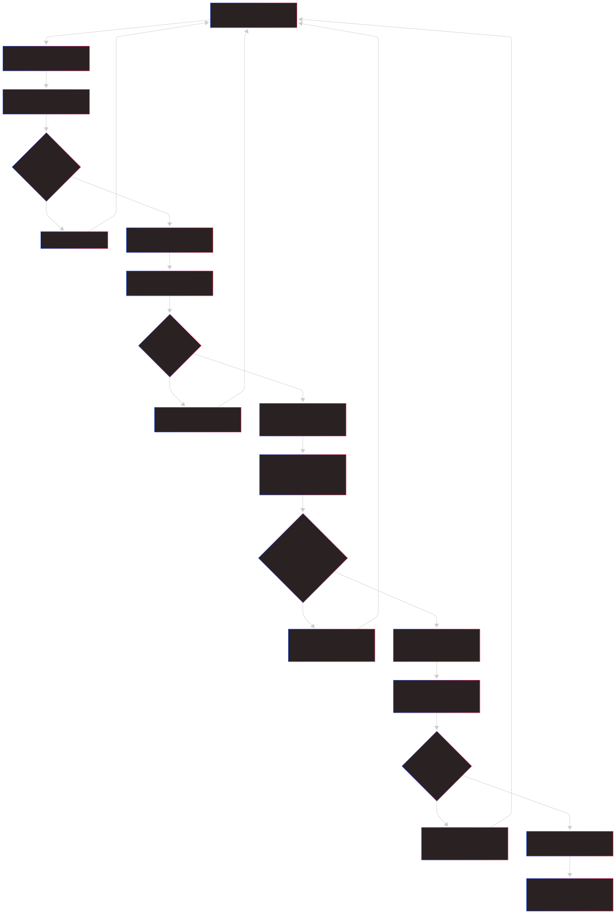
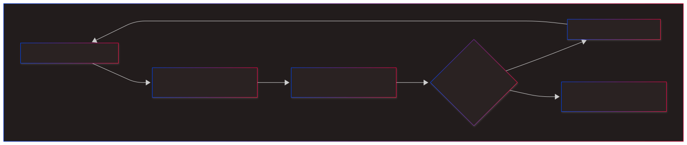
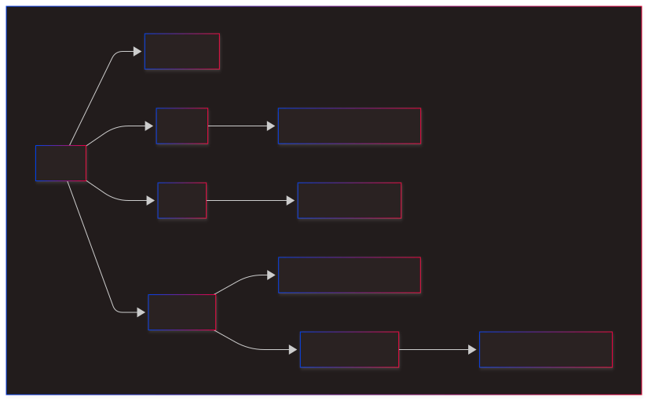
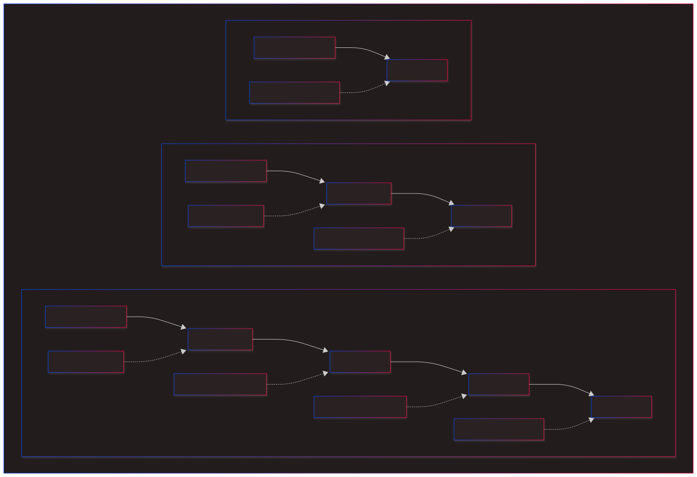

# Persistent Platform Environments (PPE's)

## Scope

This document explains the concepts behind persistent platform environments
and proposes the set of requirements to implement.

## Overview

Persistent Platform Environments (PPE's) are science platform mamba
environments that are installed directly on the platform instead of being
built into images. Wrangler makes it easy to manage the performance
differences between container storage (fast) and EFS (horrible small/many file
performance) by systematically controlling how live environments are installed
on container storage or archived on EFS for reinstallation later.

This comcept arose from these factors:

- Vastly simpler workflow
- Eliminates need for public image registry
- Enables smaller generic image:
  1. Faster spawn times
  2. Reduced attack surface / scanning maintenance

## Benefits

The benefits of User Installed Environments using `ppe`:

### Vastly simpler workflow and process

PPE determination and installation nominally reduces to the Wrangler spec curation and/or reinstallation workflows.  Since this eliminates base image updates and pipelines, there is a dramatic reduction in complexity. Since PPE's can be fully locked, paired with a simpler base environment there should be improvements in stability and cross-platform consistency.

The following diagrams illustrate the difference in complexity for the end-to-end system.

#### Complex Image Workflow

The end-to-end process of building a complex image has 3-4 phases: defining the spec, building/testing/scanning locally, PR'ing the spec and building/testing/scanning on GitHub as an image, Distributing the image to a TEST server, testing in TEST and loop back as needed, promoting to OPS, simple spawn with no archive unpack.



#### Platform Persistent Environment (PPE) Workflow

The PPE workflow is an up-scaled version of the platform's kernel-xxx scheme that supports the extra Wrangler features and uses uv and careful storage management to dramatically improve speed. An additional observation is that installing a PPE is typically no more complicated than curating an environment; consequently, an admin curating on the platform only has to save to a team or system pantry and the development and installation process is complete on that SDLC. To promote from TEST to OPS, re-installing a mission environment from the locked Wrangler spec is sound and repeatable. Other higher fidelity methods of transferring the installed binaries from TEST to OPS are possible but probably not needed.

The awareness of the disparity in complexity between the current workflow above and the on-platform curation workflow below is another compelling reason (other than better kernel-xxx) to attempt PPE's.  Note that it also eliminates multi-month/year points of organizational contention with respect to obtaining public registries or burensome image scanning and agreements and permission structures required for both.



### Faster than kernel-xxx scripts

- Provides a fast replacement for the current *kernel-xxx* scripts that also interoperate with the Wrangler system used for notebook-driven image building.

### Enables smaller, simpler base images

- Enables the creation of completely generic base-environment-only images that are ~half the size of the current two kernel (base + mission) images and spawn more rapidly. Other benefits of the simplicity are (most likely) easier and less frequent rebuilds as well as a smaller attack surface in the image.

### Fast archiving and restoration

- Measured kernel "unpack" times of 20 seconds are probably < ECR transfer times for 2-3G of environment binaries.  Archiving times are likewise fast: 40-60 seconds, once.  If faster storage than EFS is used, these times would likely further improve...  where as ECR transfer times would remain constant.

### Eliminates requirement for public registry

- Eliminates the need for but does not preclude an image host and build pipelines.
This was particularly attractive during years of struggle to get public registry support
(DockerHub or GHCR) for GitHub image building.

### Enables multiple active environments

- Enables parallel use of N kernels (including supporting data and environment variables) within a single notebook session without respawning.  This can be used to more flexibly debug old vs. new environment issues or work with multiple missions concurrently,  all without gigantic multi-environment images.

### Resolves and locks multi-notebook package constraints [optional]

- Empowers users with wrangler's capabilities for determining multi-notebook package lists and package versions when used with supported notebook repos and selected notebooks.

### Can install Wrangler specs as PPE's

- Can automatically install existing wrangler image specs as persistent environments.

### Supports rapid conversion of personal or team PPE's to images

- Provides a short path for promoting a user or teams personal environment to a notebook image supporting exactly that environment.  (Under the hood of `ppe`,  wrangler is still using a wrangler spec to define the environment.)

## What it isn't

One very significant thing which is nominally lost is Docker's ability to build once and install the same binary everywhere.  However, one example of a simple solution is just to track mission specs as part of deployments and install them to EFS using relatively trivial scripts or pipelines.

## Required Features

The requirements and design for baseline PPE's revolve around scoping to a CLI tool and defining its approach, overall interface, and command set.

### CLI Command (ppe)

   Key to making this user-friendly will be providing a CLI tool `ppe` that works in terms people are familiar with such as mamba .yaml specs and pip requirements.txt specs in addition to wrangler specs. For operating on archived environments, referring to the environment will support lookups by kernel name vs. lookup by spec.

   Although it is based upon and leverages nb-wrangler,  the `ppe` tool is the core of the PPE implementation,  see [ppe tool cli](plan-b-cli.md)


### Investigate official env archive formats

   The POC environment archiving is based on simple .tar files for environments always stored under /opt/conda.  This makes them trivially archivable and restorable,  but they are not portable to other installation locations.

  Investigate built-in mamba/micromamba environment bundling commands as a more correct solution that can potentially unarchive to other paths or other points of correction.  Another consideration is speed, if there is a major compromise support both.

### Notation for referring to specs

   Whether local, web, or archived on ghcr, including globbing.

```/bin/sh
   For pantry searches use nbw://(pattern)
   For https use https://...
   For file use <local path>
   For registry use ghcr://nbs_<glob>,  requires Docker won't work on platform
```

### Wrangler Code and Data Archive (Pantry)

The core element of Wrangler archiving is a directory structure known as a "pantry" that has one "shelf" for each environment.



Wrangler/PPE control the location of multiple pantries using an environment variable `NBW_PATH`.  Similar to PATH,  it is a colon-seperated list of pantries in priority order.

Here are some likely scenarios for pantry locations. (current, personal, team, system, or combinations there of)



#### Ability to support user, team, and mission/image level environments and archives

#### Ability to support readonly persistent archives

#### Automatic association of correct data with active kernel

## More exotic directions

### Spawn-time selection and/or unpacking

This is easily achieved by wiring automatic unpacking into the post-start-hook or shell profile and defining *what* is unpacked either inline in the profile or in a seperate PPE config file.

A more sophisticated approach could enable selection at the same time images are selected on the spawn page but the value proposition needs to be fleshed out.

### Jupyter labextension environment management

A more valuable approach to PPE management would be to build some kind of notebook or lab extension capable of performing PPE management functions from the notebook UI.  This would enable switching between versions or missions that are available for use without stopping the server and re-spawning.

### Direct EFS unpacking/installation

This is slow to set up and may have inadequate performance, but once performed the live state of the PPE is automatically available avoiding any user driven or automatic runtime restoration and corresponding waiting period of 20 seconds or so per environment.