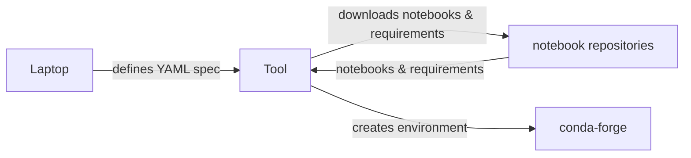

# Original nb-wrangler Intended Workflow

Here is an example of a mermaid flowchart:



To output a flowchart as markdown your output should begin on two lines as follows:

```mermaid
flowchart LR

Your output should end with:

```

all on it's own line. Together these delimit the block of mermaid code to be rendered.

The Mermaid text to describe the diagram to render is fairly simple:

- Each line of the definition is of the form:  ENTITY-1 LINE ENTITY-2

- ENTITY-1 and ENTITY-2 can be the same or different.
- An ENTITY can be a rectangular box, an oval, or a decision diamond.
- Each entity has a title rendered in the center of the shape.
- Rectangular boxes are written as:  alias[title of the box]
- Ovals are written as: alias(title of box)
- Diamonds are written as: alias{title of the diamond}
- A CONNECTOR-LINE is written as: -->|title of line|
- One an entity has been defined,  it may be referred to on subsequent lines using its alias only.
- Defining an alias is optional but preferred.

