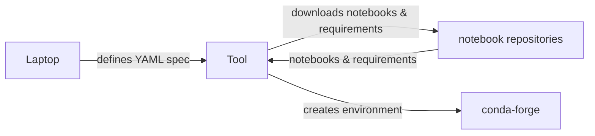

# Mermaid Flow Chart

## Syntax

The Mermaid text to describe the diagram to render is fairly simple:

- Each line of the definition is of the form:  ENTITY-1 LINE ENTITY-2

- ENTITY-1 and ENTITY-2 can be the same or different.
- An ENTITY can be a rectangular box, an oval, or a decision diamond.
- Each entity has a title rendered in the center of the shape.
- Rectangular boxes are written as:  alias[title of the box]
- Ovals are written as: alias(title of box)
- Diamonds are written as: alias{title of the diamond}
- A CONNECTOR-LINE is written as: -->|title of line|
- One an entity has been defined,  it may be referred to on subsequent lines using its alias only.
- Defining an alias is optional but preferred.

## Markdown Format for Rendering Mermaid

To output a flowchart as markdown your output should begin on two lines as follows:

````text
```mermaid
flowchart LR

Your output should end with:

```
````

all on it's own line. Together these delimit the block of mermaid code to be rendered.

## Example

Here is an example of a mermaid flowchart:



# Processing Objective

Based on the following text, please generate a diagram expressed in
Mermaid format. Focus on capturing the high-level interactions between
actors and repositories, rather than including every minute
detail.

Please include 3 clearly delimited sections of output:

0. First output the Mermaid formatted diagram as text,  as mermaid code.

1. Second output the Mermaid formatted rendered inline as discussed earlier.

2. A rewritten version of my natural language request, where you
suggest improvements or simplifications to make it more effective for
generating accurate diagrams. If you identify any ambiguous or unclear
parts of the text, please propose alternative phrasings or ask
clarifying questions.  The same goes for these meta-instructions,  if
anything stands out as a possible improvement mention it.

Please diagram the following text as described above:

# Description of Scenario to Diagram


